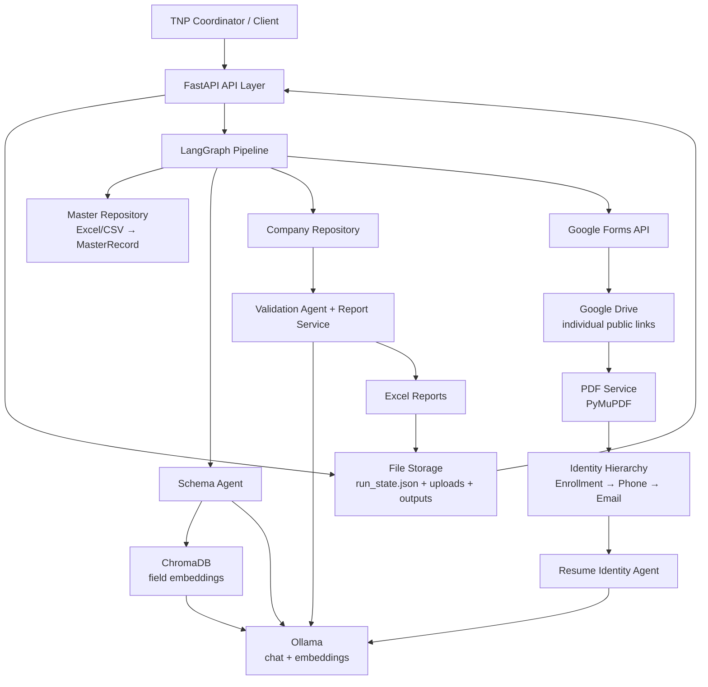
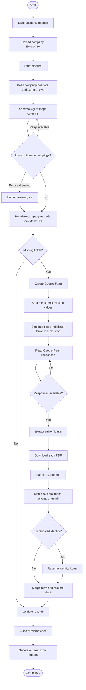

# AI-Powered TNP Database Automation Platform [PROJECT STATUS: **ONGOING**]

An intelligent backend for automating the work done by a Training and Placement (TNP) cell when a company sends a new student-data template.

The platform uses the institution's Master Student Database as the source of truth, maps each company's spreadsheet column to that database, collects additional information through Google Forms, downloads resume PDFs from student-provided Google Drive links, validates the final records, and produces ready-to-use Excel reports.

---

## 1. Problem Statement

Every time a company visits the college, the TNP team receives a different Excel template. The columns, names, and required student details are usually different from the previous company.

The team has to create and fill a separate company database manually for every drive. They must match the company's columns with the Master Student Database, find missing information, ask students for those details, collect resumes, and check whether the submitted information is correct.

This platform automates that complete process. It uses AI to understand unfamiliar column names, deterministic matching to connect students safely to their master records, Google Forms to collect missing fields, Google Drive links to fetch individual resume PDFs, and validation logic to identify mismatches.

The TNP team gets a populated company database, a validation report, and a mismatch report without manually rebuilding the database from scratch for every company.

> **In one line:** The system converts a new company spreadsheet into a validated, company-ready student database with minimal manual effort.

---

## 2. What the Platform Does

1. Loads the institution's Master Student Database once.
2. Accepts a company Excel or CSV template.
3. Understands and maps company columns to mismatched student fields.
4. Copies available values from the Master Database.
5. Identifies fields that are missing from the Master Database.
6. Creates a Google Form for the missing fields.
7. Collects each student's enrollment number, name, and resume Drive link.
8. Downloads each student's resume PDF from their individual public Drive link.
9. Extracts resume details and resolves the resume to the correct student.
10. Validates company data against the Master Database.
11. Generates three output files:

    * Populated Company Database
    * Validation Report
    * Mismatch Report

The resume workflow does **not** depend on one shared Drive folder. Every student can submit a different Google Drive URL. Each URL must point to a PDF that is shared with **Anyone with the link - Viewer** access.

---

## 3. Architecture



### Main Architectural Layers

| Layer        | Responsibility                                                               |
| ------------ | ---------------------------------------------------------------------------- |
| API layer    | Receives files and JSON requests and returns status, links, and reports      |
| Graph layer  | Orchestrates the end-to-end pipeline with LangGraph                          |
| Agents       | Uses Ollama for schema mapping, identity fallback, validation, and reminders |
| Services     | Wraps Excel, PDF, Google, LLM, embedding, vector, and report operations      |
| Repositories | Holds the Master Database and per-run company records                        |
| Storage      | Keeps uploaded files, downloaded resumes, generated reports, and run state   |

---

## 4. End-to-End Workflow



### Google Resume Flow

```text
Student
  │
  ├─ uploads resume.pdf to their own Google Drive
  ├─ sets sharing to "Anyone with the link" → "Viewer"
  └─ pastes their unique URL into the Google Form
       │
       ▼
Google Forms response
       │
       ▼
GoogleService extracts the individual file ID
       │
       ▼
HTTP/Drive download → local PDF → PDFService → identity matching
```

---

## 5. Technology Stack

| Technology              | Use                                                            |
| ----------------------- | -------------------------------------------------------------- |
| Python 3.11+            | Backend implementation                                         |
| FastAPI                 | REST API and automatic OpenAPI documentation                   |
| Uvicorn                 | Development server                                             |
| LangGraph               | Stateful pipeline orchestration and conditional routing        |
| LangChain               | Ollama chat and embedding integrations                         |
| Ollama                  | Local or externally hosted LLM and embedding inference         |
| ChromaDB                | Persistent vector index for semantic column matching           |
| Pydantic v2             | Request, response, domain-model, and structured LLM validation |
| Pandas                  | Excel/CSV reading and data normalization                       |
| OpenPyXL                | Excel report generation and formatting                         |
| PyMuPDF                 | PDF text extraction                                            |
| Google Forms API        | Dynamic form creation and response collection                  |
| Google Drive API / HTTP | Resume PDF retrieval from individual Drive links               |
| Loguru                  | Structured application and run-scoped logging                  |

---

## 6. Project Structure

```text
tnp_backend/
├── app/
│   ├── __init__.py
│   ├── config.py                    # Configuration and environment variables
│   ├── main.py                      # FastAPI application entry point
│   │
│   ├── agents/                      # AI-based processing components
│   ├── api/                         # API routes and schemas
│   ├── graph/                       # LangGraph workflow
│   ├── models/                      # Application data models
│   ├── repositories/                # Data access layer
│   ├── services/                    # Core business and external services
│   ├── storage/                     # File and vector storage
│   └── utils/                       # Shared utilities
│
├── data/                            # Runtime/application data
├── tests/                           # Tests
│
├── create_token.py                  # Google OAuth token utility
├── oauth_client.json                # Local OAuth client configuration
├── tnp-automation-5ea09ac2205d.json # Local Google service-account file
├── token.json                       # Local OAuth token
├── test_google.py                   # Google integration testing
├── test_oauth.py                    # OAuth testing
│
├── .env.example                     # Environment configuration template
├── .gitignore                       # Git ignore rules
├── pyproject.toml                   # Project metadata and dependencies
├── random.md                        # Development notes
└── README.md                        # Project documentation
```

> Local credential/token files such as `.env`, `oauth_client.json`, `token.json`, and the Google service-account JSON should not be committed to version control.

---

## 7. Setup in Your Own Environment

### Prerequisites

* Python 3.11 or newer
* An Ollama server reachable from the backend
* An Ollama chat model and embedding model
* A Google Cloud project only if real Google integration is needed

### Install

```bash
cd tnp_backend

python -m venv .venv

# Windows
.venv\Scripts\activate

# Linux/macOS
source .venv/bin/activate

pip install -e .
```

If installing from the project metadata is not available:

```bash
pip install fastapi uvicorn pandas openpyxl pymupdf \
  langchain langchain-community langchain-ollama langgraph chromadb \
  pydantic-settings loguru python-multipart requests \
  google-api-python-client google-auth google-auth-httplib2
```

### Configure Environment Variables

Create a `.env` file from `.env.example`.

Minimum Ollama configuration:

```env
OLLAMA_BASE_URL=http://localhost:11434
OLLAMA_MODEL=llama3.1
OLLAMA_EMBEDDING_MODEL=nomic-embed-text
```

If Ollama is on another machine, replace `OLLAMA_BASE_URL` with the reachable server URL.

Pull the models on the Ollama machine:

```bash
ollama pull llama3.1
ollama pull nomic-embed-text
```

### Configure Google Integration

Google is disabled by default so the backend can run offline.

1. Create or select a Google Cloud project.
2. Enable the Google Forms API and Google Drive API.
3. Create the required credentials.
4. Configure the credential path in the environment.
5. Enable Google integration.

Example:

```env
GOOGLE_INTEGRATION_ENABLED=true
GOOGLE_SERVICE_ACCOUNT_FILE=./path/to/google_service_account.json
```

Students provide separate Drive links for their resumes. Each student must set the resume file to:

```text
General access: Anyone with the link
Role: Viewer
```

### Start the Server

```bash
python -m uvicorn app.main:app --host 0.0.0.0 --port 8000 --reload
```

Open:

| Resource   | URL                                   |
| ---------- | ------------------------------------- |
| Swagger UI | `http://localhost:8000/docs`          |
| ReDoc      | `http://localhost:8000/redoc`         |
| Health     | `http://localhost:8000/api/v1/health` |

---

## 8. Screenshots

Add project screenshots in this section.

### Screenshot 1 — Swagger API Screen

`[Insert screenshot: Swagger UI showing the available API endpoints]`

### Screenshot 2 — Google Form

`[Insert screenshot: generated form with identity, resume Drive link, and missing fields]`

### Screenshot 3 — Pipeline Status

`[Insert screenshot: run status showing current node and completion state]`

### Screenshot 4 — Generated Reports

`[Insert screenshot: populated database, validation report, and mismatch report]`

---

## 9. API Reference

| Method | Endpoint                     | Purpose                               | Main Input                                                 | Output                                            |
| ------ | ---------------------------- | ------------------------------------- | ---------------------------------------------------------- | ------------------------------------------------- |
| GET    | `/health`                    | Check whether the API is running      | None                                                       | API status, version, Ollama status, Google status |
| POST   | `/master/load`               | Load/reload the Master Database       | `file_path`                                                | Load status, record count, timestamp              |
| POST   | `/forms/upload`              | Upload company Excel/CSV file         | Company file                                               | `run_id`, saved file path                         |
| POST   | `/process`                   | Start the complete pipeline           | `company_name`, `submission_deadline`, `company_file_path` | `run_id`, pipeline status                         |
| GET    | `/process/{run_id}/status`   | Check current pipeline status         | `run_id`                                                   | Status, current node, errors                      |
| POST   | `/populate`                  | Preview schema mapping and population | `run_id`                                                   | Column mappings, confidence, missing fields       |
| GET    | `/forms/{run_id}`            | Get generated Google Form information | `run_id`                                                   | Form URL, Form ID, reminder message               |
| POST   | `/validate`                  | Re-run validation for an existing run | `run_id`                                                   | Validation status, mismatch count, review count   |
| GET    | `/reports/{run_id}`          | Get generated report paths            | `run_id`                                                   | Paths to three generated reports                  |
| GET    | `/reports/{run_id}/download` | Download a generated report           | `run_id`, `report_type`                                    | Excel report file                                 |
| POST   | `/runs/{run_id}/resume`      | Resume pipeline after human review    | `corrections`                                              | `run_id`, pipeline status                         |

### API Request / Response Summary

| Endpoint                     | Request Example                                                                                   | Response Example                                                             |
| ---------------------------- | ------------------------------------------------------------------------------------------------- | ---------------------------------------------------------------------------- |
| `/master/load`               | `{"file_path": "data/master/master_database.xlsx"}`                                               | `{"status": "loaded", "record_count": 250}`                                  |
| `/forms/upload`              | Multipart company `.xlsx`, `.xls`, or `.csv` file                                                 | `{"run_id": "r_12345678", "file_path": "..."}`                               |
| `/process`                   | `{"company_name": "Acme Technologies", "submission_deadline": "...", "company_file_path": "..."}` | `{"run_id": "r_87654321", "status": "running"}`                              |
| `/process/{run_id}/status`   | `run_id`                                                                                          | `{"run_id": "...", "status": "running", "current_node": "run_schema_agent"}` |
| `/populate`                  | `{"run_id": "r_12345678"}`                                                                        | Column mappings and missing fields                                           |
| `/forms/{run_id}`            | `run_id`                                                                                          | Google Form URL, ID, reminder message                                        |
| `/validate`                  | `{"run_id": "r_12345678"}`                                                                        | `{"status": "completed", "mismatch_count": 4}`                               |
| `/reports/{run_id}`          | `run_id`                                                                                          | Paths to populated database, validation and mismatch reports                 |
| `/reports/{run_id}/download` | `report_type=populated_database`                                                                  | Requested Excel report                                                       |
| `/runs/{run_id}/resume`      | Corrections for mapping/identity review                                                           | `{"run_id": "...", "status": "running"}`                                     |

### Report Types

| Value                | Report                     |
| -------------------- | -------------------------- |
| `populated_database` | Populated Company Database |
| `validation_report`  | Validation Report          |
| `mismatch_report`    | Mismatch Report            |

### Pipeline Status Values

| Status                  | Meaning                          |
| ----------------------- | -------------------------------- |
| `running`               | Pipeline is currently processing |
| `awaiting_human_review` | Pipeline requires manual review  |
| `completed`             | Pipeline finished successfully   |
| `failed`                | Pipeline encountered an error    |

---

## 10. Configuration Reference

| Variable                               | Default                      | Purpose                                    |
| -------------------------------------- | ---------------------------- | ------------------------------------------ |
| `OLLAMA_BASE_URL`                      | `http://localhost:11434`     | Ollama server URL                          |
| `OLLAMA_MODEL`                         | `llama3.1`                   | Chat/reasoning model                       |
| `OLLAMA_EMBEDDING_MODEL`               | `nomic-embed-text`           | Embedding model                            |
| `LLM_TEMPERATURE`                      | `0.1`                        | Temperature for structured decisions       |
| `LLM_REMINDER_TEMPERATURE`             | `0.3`                        | Temperature for reminder writing           |
| `LLM_MAX_TOKENS`                       | `2048`                       | Maximum LLM response tokens                |
| `LLM_TIMEOUT_SECONDS`                  | `60`                         | LLM request timeout                        |
| `COLUMN_MAPPING_CONFIDENCE_THRESHOLD`  | `0.7`                        | Auto-accept mapping threshold              |
| `IDENTITY_CONFIDENCE_THRESHOLD`        | `0.75`                       | Auto-accept resume identity threshold      |
| `SCHEMA_AGENT_LOW_CONFIDENCE_FRACTION` | `0.3`                        | Retry/escalation threshold                 |
| `SCHEMA_AGENT_MAX_RETRIES`             | `2`                          | Maximum schema retries                     |
| `DATA_DIR`                             | `./data`                     | Runtime data root                          |
| `CHROMA_PERSIST_DIR`                   | `./app/storage/chroma_store` | ChromaDB directory                         |
| `GOOGLE_INTEGRATION_ENABLED`           | `false`                      | Enables real Google APIs                   |
| `GOOGLE_SERVICE_ACCOUNT_FILE`          | —                            | Service-account JSON path                  |
| `GOOGLE_DRIVE_FOLDER_ID`               | —                            | Only needed for rare file-upload questions |
| `PORT`                                 | `8000`                       | API port                                   |
| `LOG_LEVEL`                            | `INFO`                       | Logging level                              |

---

## 11. Future Enhancements

* Persistent run database instead of in-memory run status.
* Scheduled form-response polling and deadline reminders.
* Real WhatsApp Business or Twilio sender.
* Authentication and role-based access for TNP coordinators.
* Dashboard for run progress, review queues, and report downloads.
* Stronger validation for Drive URLs and PDF MIME type/size before parsing.

---

## Quick Summary

```text
Company Excel
      │
      ▼
 FastAPI API
      │
      ▼
LangGraph Pipeline
      │
      ├── Master Database
      │
      ├── Schema Agent
      │      ├── Ollama
      │      └── ChromaDB
      │
      ├── Google Form
      │      └── Student Information + Resume
      │
      ├── Resume Processing
      │      └── Identity Matching
      │
      └── Validation
              │
              ▼
       Excel Reports
```

> **Core idea:** The Master Database is the source of truth. AI handles ambiguous tasks, LangGraph orchestrates the workflow, and the system produces a validated company-ready database automatically.
