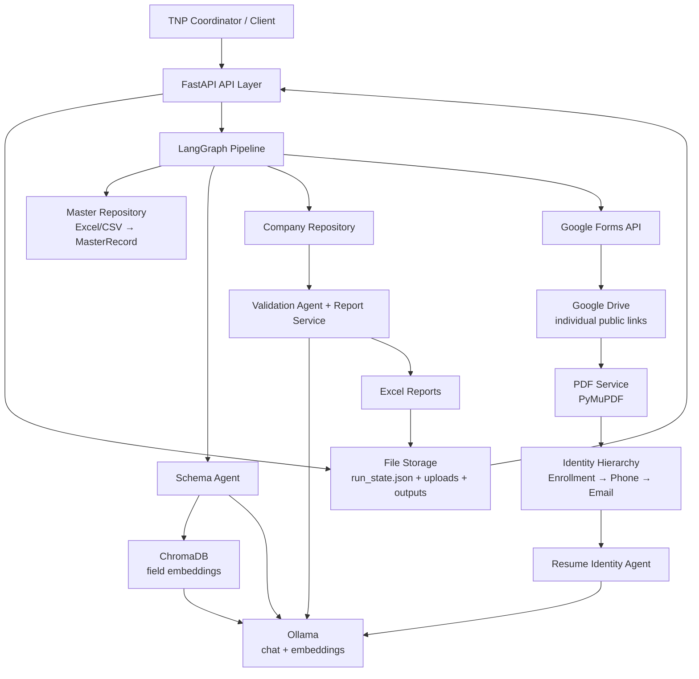

# AI-Powered TNP Database Automation Platform

An intelligent backend for automating the work done by a Training and Placement
(TNP) cell when a company sends a new student-data template.

The platform uses the institution's Master Student Database as the source of
truth, maps each company's spreadsheet column to that database, collects
additional information through Google Forms, downloads resume PDFs from student
provided Google Drive links, validates the final records, and produces ready to
use Excel reports.

---

## 1. Problem Statement

### Situation

Every time a company visits the college, the TNP team receives a different Excel
template. The columns, names, and required student details are usually
different from the previous company.

### Task

The team has to create and fill a separate company database manually for every
drive. They must match the company's columns with the Master Student Database,
find missing information, ask students for those details, collect resumes, and
check whether the submitted information is correct.

### Action

This platform automates that complete process. It uses AI to understand
unfamiliar column names, deterministic matching to connect students safely to
their master records, Google Forms to collect missing fields, Google Drive links
to fetch individual resume PDFs, and validation logic to identify mismatches.

### Result

The TNP team gets a populated company database, a validation report, and a
mismatch report without manually rebuilding the database from scratch for every
company.

> **In one line:** The system converts a new company spreadsheet into a
> validated, company-ready student database with minimal manual effort.

---

## 2. What the Platform Does

1. Loads the institution's Master Student Database once.
2. Accepts a company Excel or CSV template.
3. Understands and maps company columns to mismatched student fields.
4. Copies available values from the Master Database.
5. Identifies fields that are missing from the Master Database.
6. Creates a Google Form for the missing fields.
7. Collects each student's enrollment number, name, and resume Drive link.
8. Downloads each student's resume PDF from their individual public Drive link.
9. Extracts resume details and resolves the resume to the correct student.
10. Validates company data against the Master Database.
11. Generates three output files:
    - Populated Company Database
    - Validation Report
    - Mismatch Report

The resume workflow does **not** depend on one shared Drive folder. Every
student can submit a different Google Drive URL. Each URL must point to a PDF
that is shared with **Anyone with the link - Viewer** access.

---

## 3. Architecture



### Main architectural layers

| Layer | Responsibility |
|---|---|
| API layer | Receives files and JSON requests and returns status, links, and reports |
| Graph layer | Orchestrates the end-to-end pipeline with LangGraph |
| Agents | Uses Ollama for schema mapping, identity fallback, validation, and reminders |
| Services | Wraps Excel, PDF, Google, LLM, embedding, vector, and report operations |
| Repositories | Holds the Master Database and per-run company records |
| Storage | Keeps uploaded files, downloaded resumes, generated reports, and run state |

---

## 4. End-to-End Workflow


### Google resume flow

```text
Student
  │
  ├─ uploads resume.pdf to their own Google Drive
  ├─ sets sharing to "Anyone with the link" → "Viewer"
  └─ pastes their unique URL into the Google Form
       │
       ▼
Google Forms response
       │
       ▼
GoogleService extracts the individual file ID
       │
       ▼
HTTP/Drive download → local PDF → PDFService → identity matching
```

---

## 5. Technology Stack

| Technology | Use |
|---|---|
| Python 3.11+ | Backend implementation |
| FastAPI | REST API and automatic OpenAPI documentation |
| Uvicorn | ASGI development server |
| LangGraph | Stateful pipeline orchestration and conditional routing |
| LangChain | Ollama chat and embedding integrations |
| Ollama | Local or externally hosted LLM and embedding inference |
| ChromaDB | Persistent vector index for semantic column matching |
| Pydantic v2 | Request, response, domain-model, and structured LLM validation |
| Pandas | Excel/CSV reading and data normalization |
| OpenPyXL | Excel report generation and formatting |
| PyMuPDF (`fitz`) | PDF text extraction |
| Google Forms API | Dynamic form creation and response collection |
| Google Drive API / HTTP | Resume PDF retrieval from individual Drive links |
| Loguru | Structured application and run-scoped logging |

---

## 6. Project Structure

```text
tnp_backend/
├── .env.example                 # Configuration template
├── .gitignore                   # Ignores secrets, runtime data, and caches
├── pyproject.toml               # Python metadata and dependencies
├── README.md                    # Project documentation
│
├── credentials/                 # Local Google service-account file (not committed)
│   └── google_service_account.json
│
├── data/                        # Runtime data; normally gitignored
│   ├── master/                  # Master Database files
│   └── runs/
│       └── <run_id>/
│           ├── uploads/         # Company file and downloaded resume PDFs
│           ├── outputs/         # Generated Excel reports
│           └── run_state.json   # Serializable pipeline snapshot
│
├── tests/                       # Unit tests and fixture guidance
│   ├── fixtures/README.md       # How to prepare test input files
│   └── unit/                    # Focused service and utility tests
│
└── app/
    ├── __init__.py              # Python package marker
    ├── main.py                  # FastAPI app, CORS, startup, health endpoint
    ├── config.py                # Pydantic Settings and environment variables
    │
    ├── api/
    │   ├── __init__.py          # API package marker
    │   ├── schemas/
    │   │   ├── requests.py      # Pydantic request bodies
    │   │   └── responses.py     # Pydantic response bodies
    │   └── routes/
    │       ├── master_routes.py     # Load/reload the Master Database
    │       ├── form_routes.py       # Upload company files and get form status
    │       ├── process_routes.py    # Start and poll full pipeline runs
    │       ├── populate_routes.py   # Preview schema mapping and population
    │       ├── validate_routes.py   # Re-run validation
    │       └── report_routes.py     # Read/download reports and resume review
    │
    ├── models/
    │   ├── master_record.py       # Authoritative student record
    │   ├── company_record.py      # Per-company student record
    │   ├── column_mapping.py      # Schema Agent mapping result
    │   ├── resume_data.py         # Parsed resume and identity result
    │   ├── validation_result.py   # Field and student validation results
    │   └── run.py                 # Run metadata and lifecycle status
    │
    ├── services/
    │   ├── llm_service.py         # Ollama chat calls and structured JSON retries
    │   ├── embedding_service.py  # Ollama embedding calls
    │   ├── vector_service.py      # ChromaDB persistence and similarity search
    │   ├── excel_service.py       # Excel/CSV input and Excel output
    │   ├── pdf_service.py         # PDF text extraction and field extraction
    │   ├── google_service.py      # Google Forms responses and Drive PDF downloads
    │   ├── whatsapp_service.py    # Reminder formatting and sender extension point
    │   └── report_service.py      # Validation, mismatch classification, reports
    │
    ├── repositories/
    │   ├── master_repository.py      # Master records and identity indices
    │   ├── company_repository.py     # Per-run company data and enrichment
    │   ├── vector_repository.py      # Master field vector collection
    │   └── collection_repository.py  # Form-response normalization
    │
    ├── agents/
    │   ├── schema_agent.py                    # Maps company columns to known fields
    │   ├── resume_extract_identity_agent.py   # AI fallback for resume identity
    │   ├── validation_agent.py                # Classifies ambiguous differences
    │   └── reminder_agent.py                  # Drafts student reminders
    │
    ├── graph/
    │   ├── state.py             # PipelineState passed between graph nodes
    │   ├── nodes.py             # Individual pipeline operations
    │   ├── edges.py             # Conditional routing decisions
    │   └── pipeline_graph.py    # Graph assembly and compiled singleton
    │
    ├── storage/
    │   ├── file_storage.py      # Run directories, uploads, and JSON state
    │   └── chroma_store/        # Persistent ChromaDB files
    │
    └── utils/
        ├── constants.py         # Canonical fields, patterns, and output names
        ├── identity_hierarchy.py # Enrollment → phone → email matching
        └── logging.py           # Loguru configuration and run log context
```

### Important data concepts

- **Master Database:** The trusted institutional student database.
- **Company Database:** A per-company working copy populated from the Master
  Database and enriched with form and resume data.
- **Canonical field:** A normalized name such as `enrollment_number`, `email`,
  `phone_number`, or `cgpa`.
- **Run:** One complete processing attempt for one company template.
- **Human review:** A safety stop used when schema or resume identity confidence
  is not high enough for automatic acceptance.

---

## 7. Setup in Your Own Environment

### Prerequisites

- Python 3.11 or newer
- An Ollama server reachable from the backend
- An Ollama chat model and embedding model
- A Google Cloud project only if real Google integration is needed

### Install

```bash
cd tnp_backend

python -m venv .venv
source .venv/bin/activate        # Windows: .venv\Scripts\activate

pip install -e .
```

If installing from the project metadata is not available:

```bash
pip install fastapi uvicorn pandas openpyxl pymupdf \
  langchain langchain-community langchain-ollama langgraph chromadb \
  pydantic-settings loguru python-multipart requests \
  google-api-python-client google-auth google-auth-httplib2
```

### Configure environment variables

```bash
cp .env.example .env
```

Minimum Ollama configuration:

```env
OLLAMA_BASE_URL=http://localhost:11434
OLLAMA_MODEL=llama3.1
OLLAMA_EMBEDDING_MODEL=nomic-embed-text
```

If Ollama is on another machine, replace `OLLAMA_BASE_URL` with the reachable
server URL. Pull the models on the Ollama machine:

```bash
ollama pull llama3.1
ollama pull nomic-embed-text
```

### Configure Google integration

Google is disabled by default so the backend can run offline.

1. Create or select a Google Cloud project.
2. Enable the Google Forms API and Google Drive API.
3. Create a service account and download its JSON key.
4. Store the JSON file at a private path such as:
   `credentials/google_service_account.json`.
5. Set:

```env
GOOGLE_INTEGRATION_ENABLED=true
GOOGLE_SERVICE_ACCOUNT_FILE=./credentials/google_service_account.json
```

The standard resume flow does **not** require `GOOGLE_DRIVE_FOLDER_ID`.
Students provide separate Drive links. Each student must set their resume file
to:

```text
General access: Anyone with the link
Role: Viewer
```

Never commit the service-account JSON file. The `.gitignore` should exclude the
credentials directory and `.env`.

### Start the server

```bash
python -m uvicorn app.main:app --host 0.0.0.0 --port 8000 --reload
```

Open:

- Swagger UI: `http://localhost:8000/docs`
- ReDoc: `http://localhost:8000/redoc`
- Health: `http://localhost:8000/api/v1/health`

### Run tests

```bash
pytest tests/ -v
```

### Typical local sequence

```bash
# 1. Load the institution's Master Database
curl -X POST http://localhost:8000/api/v1/master/load \
  -H "Content-Type: application/json" \
  -d '{"file_path":"data/master/master_database.xlsx"}'

# 2. Upload a company template
curl -X POST http://localhost:8000/api/v1/forms/upload \
  -F "file=@/absolute/path/company_template.xlsx"

# 3. Start the pipeline using the returned file_path
curl -X POST http://localhost:8000/api/v1/process \
  -H "Content-Type: application/json" \
  -d '{
    "company_name":"Acme Technologies",
    "submission_deadline":"2026-09-01T18:00:00Z",
    "company_file_path":"data/runs/r_12345678/uploads/company_template.xlsx"
  }'

# 4. Poll the returned run_id
curl http://localhost:8000/api/v1/process/r_12345678/status

# 5. Get the form link after the form stage
curl http://localhost:8000/api/v1/forms/r_12345678

# 6. Get report paths after completion
curl http://localhost:8000/api/v1/reports/r_12345678
```

---

## 8. Screenshots

Add project screenshots in this section. Suggested screenshots:

### Screenshot 1 — Swagger API screen

<!-- Replace this placeholder with an image:

-->

`[Insert screenshot: Swagger UI showing the available API endpoints]`

### Screenshot 2 — Google Form

<!-- Replace this placeholder with an image:

-->

`[Insert screenshot: generated form with identity, resume Drive link, and missing fields]`

### Screenshot 3 — Pipeline status

<!-- Replace this placeholder with an image:

-->

`[Insert screenshot: run status showing current node and completion state]`

### Screenshot 4 — Generated reports

<!-- Replace this placeholder with an image:

-->

`[Insert screenshot: populated database, validation report, and mismatch report]`

---

## 9. API Reference

The base URL is:

```text
http://localhost:8000/api/v1
```

Interactive documentation is generated automatically at `/docs`.

### `GET /health`

Checks whether the API is running and returns the configured Ollama URL and
Google integration status.

```bash
curl http://localhost:8000/api/v1/health
```

Example response:

```json
{
  "status": "ok",
  "version": "1.0.0",
  "ollama_base_url": "http://localhost:11434",
  "google_integration_enabled": false
}
```

### `POST /master/load`

Loads or reloads the Master Database from a server-local Excel or CSV path.
The file must contain the required identity fields: enrollment number and name.

Request:

```json
{
  "file_path": "data/master/master_database.xlsx"
}
```

Response:

```json
{
  "status": "loaded",
  "record_count": 250,
  "loaded_at": "2026-08-24T10:30:00Z"
}
```

### `POST /forms/upload`

Uploads a company `.xlsx`, `.xls`, or `.csv` file. This creates a run directory
and returns the generated `run_id` and saved file path.

```bash
curl -X POST http://localhost:8000/api/v1/forms/upload \
  -F "file=@company_template.xlsx"
```

Response:

```json
{
  "run_id": "r_12345678",
  "file_path": "data/runs/r_12345678/uploads/company_template.xlsx",
  "message": "File uploaded successfully."
}
```

### `POST /process`

Starts the full pipeline in the background. Load the Master Database first.

Request:

```json
{
  "company_name": "Acme Technologies",
  "submission_deadline": "2026-09-01T18:00:00Z",
  "company_file_path": "data/runs/r_12345678/uploads/company_template.xlsx"
}
```

Response:

```json
{
  "run_id": "r_87654321",
  "status": "running"
}
```

### `GET /process/{run_id}/status`

Returns the current pipeline status.

```bash
curl http://localhost:8000/api/v1/process/r_87654321/status
```

Example:

```json
{
  "run_id": "r_87654321",
  "status": "running",
  "current_node": "run_schema_agent",
  "errors": []
}
```

Possible statuses include `running`, `awaiting_human_review`, `completed`, and
`failed`.

### `POST /populate`

Runs schema mapping and population preview without starting the full Google Form
and validation workflow. The run must already contain an uploaded company file.

Request:

```json
{
  "run_id": "r_12345678"
}
```

Response:

```json
{
  "run_id": "r_12345678",
  "column_mappings": [
    {
      "company_column": "Roll No",
      "mapped_field": "enrollment_number",
      "confidence": 0.98,
      "status": "mapped"
    }
  ],
  "missing_fields": ["Expected Salary"]
}
```

### `GET /forms/{run_id}`

Returns the generated Google Form details after the form stage.

```json
{
  "run_id": "r_12345678",
  "google_form_url": "https://docs.google.com/forms/d/FORM_ID/viewform",
  "google_form_id": "FORM_ID",
  "whatsapp_message": "..."
}
```

The form contains enrollment number, student name, resume Drive link, and any
additional fields detected as missing.

### `POST /validate`

Re-runs validation for an existing in-memory run, useful after review or
correction.

Request:

```json
{
  "run_id": "r_12345678"
}
```

Response:

```json
{
  "run_id": "r_12345678",
  "status": "completed",
  "mismatch_count": 4,
  "flagged_for_review": 1
}
```

### `GET /reports/{run_id}`

Returns paths for the generated report files.

```json
{
  "run_id": "r_12345678",
  "populated_database_path": "data/runs/r_12345678/outputs/populated_company_db.xlsx",
  "validation_report_path": "data/runs/r_12345678/outputs/validation_report.xlsx",
  "mismatch_report_path": "data/runs/r_12345678/outputs/mismatch_report.xlsx"
}
```

### `GET /reports/{run_id}/download`

Downloads one generated report.

Query parameter:

```text
report_type=populated_database
report_type=validation_report
report_type=mismatch_report
```

Example:

```bash
curl -L \
  "http://localhost:8000/api/v1/reports/r_12345678/download?report_type=populated_database" \
  -o populated_company_db.xlsx
```

### `POST /runs/{run_id}/resume`

Submits corrections after a run pauses for human review.

Request:

```json
{
  "corrections": [
    {
      "type": "column_mapping",
      "company_column": "Student Roll",
      "mapped_field": "enrollment_number"
    },
    {
      "type": "identity_resolution",
      "resume_file": "data/runs/r_12345678/uploads/21CS045_resume.pdf",
      "master_record_id": "21CS045"
    }
  ]
}
```

Response:

```json
{
  "run_id": "r_12345678",
  "status": "running"
}
```

---

## 10. Configuration Reference

| Variable | Default | Purpose |
|---|---|---|
| `OLLAMA_BASE_URL` | `http://localhost:11434` | Ollama server URL |
| `OLLAMA_MODEL` | `llama3.1` | Chat/reasoning model |
| `OLLAMA_EMBEDDING_MODEL` | `nomic-embed-text` | Embedding model |
| `LLM_TEMPERATURE` | `0.1` | Temperature for structured decisions |
| `LLM_REMINDER_TEMPERATURE` | `0.3` | Temperature for reminder writing |
| `LLM_MAX_TOKENS` | `2048` | Maximum LLM response tokens |
| `LLM_TIMEOUT_SECONDS` | `60` | LLM request timeout |
| `COLUMN_MAPPING_CONFIDENCE_THRESHOLD` | `0.7` | Auto-accept mapping threshold |
| `IDENTITY_CONFIDENCE_THRESHOLD` | `0.75` | Auto-accept resume identity threshold |
| `SCHEMA_AGENT_LOW_CONFIDENCE_FRACTION` | `0.3` | Retry/escalation threshold |
| `SCHEMA_AGENT_MAX_RETRIES` | `2` | Maximum schema retries |
| `DATA_DIR` | `./data` | Runtime data root |
| `CHROMA_PERSIST_DIR` | `./app/storage/chroma_store` | ChromaDB directory |
| `GOOGLE_INTEGRATION_ENABLED` | `false` | Enables real Google APIs |
| `GOOGLE_SERVICE_ACCOUNT_FILE` | — | Service-account JSON path |
| `GOOGLE_DRIVE_FOLDER_ID` | — | Only needed for rare file-upload questions |
| `PORT` | `8000` | API port |
| `LOG_LEVEL` | `INFO` | Logging level |

---

## 11. Safety and Operational Notes

- The Master Database should be treated as the authoritative source.
- Low-confidence schema mappings and resume identities are not silently
  accepted; they can go through human review.
- Public Drive links are required for resume downloads. A private link that is
  inaccessible to the service account cannot be downloaded.
- Do not commit `.env`, service-account JSON files, student data, or generated
  reports.
- The current run-status store is in memory. A production deployment should
  replace it with a persistent database or job queue.
- WhatsApp delivery is currently an extension point; the backend formats the
  reminder message but does not yet send through a live provider.

---

## 12. Future Enhancements

- Persistent run database instead of in-memory run status.
- Scheduled form-response polling and deadline reminders.
- Real WhatsApp Business or Twilio sender.
- Authentication and role-based access for TNP coordinators.
- Dashboard for run progress, review queues, and report downloads.
- Stronger validation for Drive URLs and PDF MIME type/size before parsing.
